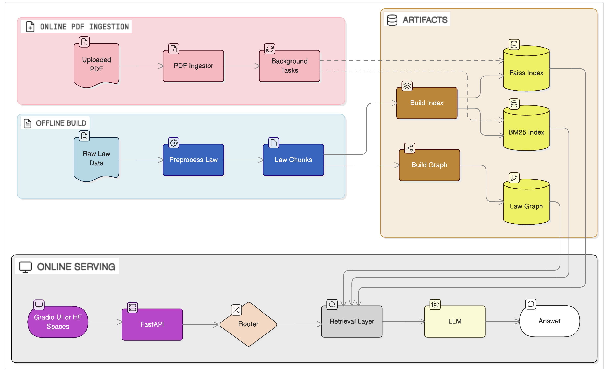

# Legal-RAG


[](https://huggingface.co/spaces/flora-l/Legal-RAG)
[]
[](https://www.apache.org/licenses/LICENSE-2.0)

> **C针对中国《民法典·合同编》的条文检索、问答与推理系统**

**Legal-RAG** 支持条文问答、多轮对话、PDF 上传解析，可用于法律研究、教学演示与原型系统搭建。


## 功能特性（Features）

* 法条预处理 Legal text preprocessing → JSONL
* 混合检索 Hybrid retrieval：FAISS 向量 + BM25 精确匹配
- **LLM 回答**
  - 本地 **Qwen**（默认）
  - 可选 **OpenAI API**  
* **法律知识路由（Routing）** 
- **服务与界面**
  - FastAPI 后端 API
  - Web UI（多轮问答、条文展示、PDF 上传）
* 脚本支持
  - 法条预处理 / 索引构建 / 检索评估

## 在线演示（Hugging Face Spaces）
  可直接访问 https://huggingface.co/spaces/flora-l/Legal-RAG （在线 Demo，无需本地环境）

  使用 OpenAI，请在 Hugging Face Space 的 **Settings → Variables and secrets** 中设置：
  - `OPENAI_API_KEY`（必需）
  - `OPENAI_MODEL`（可选，如 `gpt-4o-mini`）


## 系统架构（System Architecture）




## 快速开始（Quickstart）


### 1. 克隆项目并安装依赖
```bash
git clone https://github.com/Fan-Luo/Legal-RAG.git
cd Legal-RAG
pip install -r requirements.txt
````

### 2. 准备法律数据并构建索引
```bash
# 《民法典》文本位于 data/raw/minfadian.txt
#  可替换为你需要的其他法律文本

# 预处理为 JSONL
python -m scripts.preprocess_law

# 构建 FAISS + BM25 索引
python -m scripts.build_index
````
### 3. 启动 API 服务
```bash
python -m uvicorn legalrag.api.server:app --host 127.0.0.1 --port 8000
````
> 默认使用本地 Qwen 模型（如 Qwen/Qwen2-1.5B-Instruct），需要本地机器有GPU 和足够内存。
> 如需使用 OpenAI，请参考 「在线演示（Hugging Face Spaces） / OpenAI 配置」。

### 4. 打开演示界面
访问：http://127.0.0.1:8000/ 或 http://127.0.0.1:8000/ui/

支持功能：
  - 多轮法律问答
  - 条文折叠展示
  - PDF 上传解析（自动增量索引）


## 示例（Example）

```python
from legalrag.config import AppConfig
from legalrag.pipeline.rag_pipeline import RagPipeline

cfg = AppConfig.load(None)
pipeline = RagPipeline(cfg)

question = "合同生效后，如果对价款和履行地点没有约定，应当如何处理？"
ans = pipeline.answer(question)

print("Question:", question)
print("Answer:", ans.answer)
```

> 1. 结论：
>   - 经过全面分析与理解，我们认为，当合同对价款和履行地点没有约定时，合同生效后，当事人可以根据合同相关条款或者交易习惯确定支付价款和履行地点。这体现了合同自由的原则和诚实信用的基本精神。
>   
> 2. 分析与理由：
>   - 我们首先确认了《民法典·合同编》第五百一十条中明确规定的合同生效后当事人的支付地点选择权：
>     - 在没有具体约定的情况下，应由双方协商确定或依据合同惯例；
>     - 如协商不成，可依合同相关条款或交易习惯确定。
>     
>   - 对于履行地点的选择，我们援引了第六百二十七条中的相关规定，强调了在合同签订时就已经明确了合同履行地点。尽管如此，这一条款并不足以涵盖所有可能的情况，因此我们还需要考虑合同的实际履行情况来进一步判断。
>
> 3. 参考条文列表：
>   - （核心依据）
>       - 第五百一十条
>   - （次要参考）
>       - 第六百二十七条

 

## 📂 项目结构（Project Structure）

```
Legal-RAG/
│
├── legalrag/
│   ├── __init__.py
│   ├── config.py                  # AppConfig / Paths / LLM / Retrieval
│   ├── models.py                  # LawChunk / RetrievalHit / RoutingDecision / RagAnswer
│   ├── llm/
│   │   ├── __init__.py
│   │   └── client.py              # Qwen / OpenAI LLMClient（async-safe）
│   │
│   ├── retrieval/
│   │   ├── __init__.py
│   │   ├── vector_store.py        # Dense (BGE + FAISS)
│   │   ├── bm25_retriever.py      # Sparse (BM25 + jieba)
│   │   ├── hybrid_retriever.py    # Dense + Sparse + 权重融合
│   │   ├── corpus_loader.py       # read all chunks from processed_dir
│   │   ├── incremental_indexer.py
│   │   └── graph_store.py         # law_graph / legal_kg 读取与 walk
│   │
│   ├── routing/
│   │   ├── __init__.py
│   │   └── router.py              # QueryType + Graph/RAG 建议
│   │
│   ├── pdf/
│   │   ├── __init__.py
│   │   └── parser.py              # pdfplumber + OCR fallback
│   │
│   ├── ingest/
│   │   ├── __init__.py
│   │   └── ingestor.py            # PDFIngestor 
│   │
│   ├── pipeline/
│   │   ├── __init__.py
│   │   └── rag_pipeline.py        # Graph-aware RAG 核心推理链
│   │
│   ├── prompts/
│   │   └── legal_rag_prompt.txt   # Prompt 
│   │
│   ├── utils/
│   │   ├── __init__.py
│   │   ├── logger.py              # 日志 
│   │   └── text.py                # 文本清洗 / 正则工具
│   │
│   └── api/
│       ├── __init__.py
│       └── server.py              # FastAPI（/rag/query, /, ingest/pdf）
│
├── ui/
│   └── index.html
│
├── scripts/
│   ├── preprocess_law.py          # 法条解析 → LawChunk JSONL
│   ├── build_index.py             # FAISS + BM25 索引构建
│   ├── build_graph.py             # law_graph / legal_kg 构建
│   └── evaluate_retrieval.py      # Hit@K / MRR / nDCG
│
├── notebooks/
│   ├── 01_kaggle_build_index_and_eval.ipynb
│   ├── 02_colab_qwen_rag_demo.ipynb
│   ├── 03_retrieval_visualization.ipynb
│   ├── 04_retrieval_benchmark_legal.ipynb
│   └── 05_rag_answer_eval.ipynb
│
├── data/
│   ├── raw/                        # 原始法律文本
│   │   └── minfadian.txt           # 《民法典》
│   └── eval/
│       └── contract_law_qa.jsonl
├── docs/
│   ├── architecture.mmd
│   └── architecture.png
├── tests/
│   ├── test_router.py
│   └── test_retrieval.py
├── README.md
├── README-zh.md
├── LICENSE
├── pyproject.toml
├── requirements.txt
├── app.py                           # Hugging Face Spaces entry
├── Dockerfile
└── .gitignore                       # Git 忽略配置

```


## 可扩展方向 (Extensibility)：
  - 更复杂的法律知识图谱
  - 高级查询路由 / 多模型融合
  - 支持其他法律领域或多语种
* PDF 上传建议使用可复制文本的 PDF，提高解析准确率
* 本地 LLM（Qwen / BGE）建议使用 GPU 或充足显存；OpenAI API 为可选方案


## 许可声明（License）

Apache License 2.0

本仓库仅包含源码，不包含第三方模型权重。用户需自行遵守所使用模型的许可证（如 Qwen、BGE、OpenAI 等）。


## 免责声明（Disclaimer）

本项目仅用于提供法律信息辅助，供学习与研究参考之用，不构成任何形式的法律意见或法律建议。
使用者不应将本项目作为专业法律咨询的替代，因使用本项目所产生的任何直接或间接后果，项目作者及贡献者不承担任何责任。

